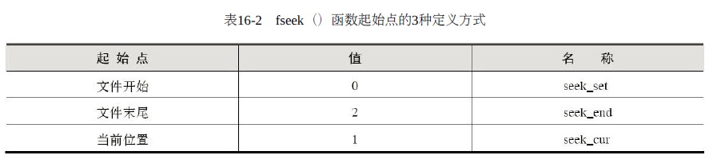

# 文件的定位

> 前面介绍的文件读写是针对顺序读写的情况。实际上，文件的读写方式有两种:
> ① 顺序读写，位置指针按字节顺序从头到尾移动；
> ② 随机读写，位置指针按需要移动到任意位置。随机形式多用于二进制文件的读写。

如果要对文件进行随机读写，就需要控制文件位置指针的值，这就是文件的定位。


## 1. 移动指针到文件开头`rewind()`

`rewind()`函数没有返回值，其调用形式为
```c
rewind( FILE*fp );
```

例如有一个文件`file1.txt`，要求第一次**使它的内容显示在屏幕上**，第二次**把它复制到另一个文件`file2.txt`上**，然后再关闭文件。其具体步骤为：
1. 以读的方式打开文件，`fp`保存打开文件的指针。
2. 从文件中读出数据，输出到屏幕上。
3. 返回该文件内部指针到文件开头。
4. 打开另外一个文件，实现两个文件的复制操作。
5. 关闭文件。

## 2. 移动指针到当前位置`ftell()`

随机形式允许文件位置指针跳来跳去。为得到文件指针的当前位置，C语言标准库提供了`ftell()`函数，其原型为：
```c
long ftell (FILE*)；
```

执行成功时，返回当前文件指针的值，否则，返回-1L（L表示该-1为long型常量），用其可进行防错处理。例如下面的语句段：
```c
long n；
if ((n=ftell(fp)) == -1L)
printf("A file error has occurred at %ld.\n", i);
```
该语句段可通知用户在文件什么位置出现了错误。

## 3. 移动指针`fseek()`

文件定位中最重要的一个函数是`fseek()`，用以控制、调整文件指针的值，从而改变下一次读写操作的位置。其函数原型为：
```c
int fseek(FILE * fp, long offset, int startPos);
```
其中，`fp`是文件指针，`startPos`是起始点，`offset`是目标位置相对起始点的偏移量，可以为负数，如果函数操作执行
成功，文件位置指针将被设定为“起始点+`offset`”。起始点并不是任意设定的，C语言给出了3种起始点定义方式



既可以使用`0`、`1`或`2`作参数传递给`fseek()`函数，也可以使用诸如`seek_set`之类的名称。如果`fseek()`函数执行正
确，返回0，否则，返回非0。


